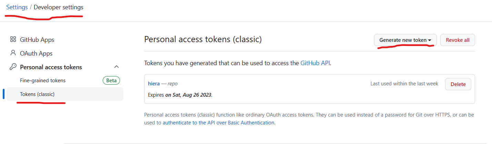
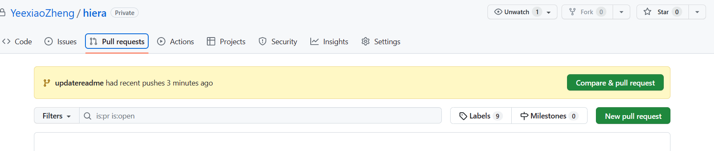
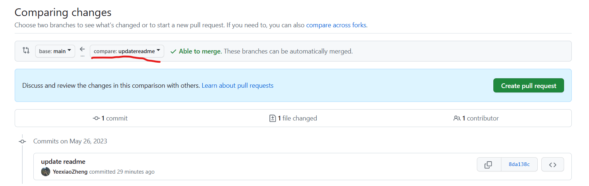
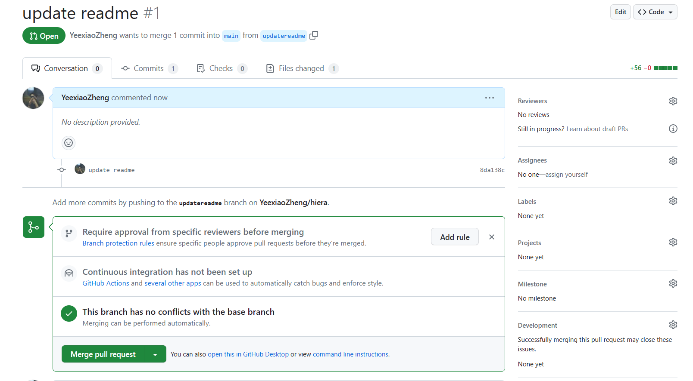

# Branch zm
## Update 2023/7/4
zm分支新增**argparse**功能，可通过命令行解析输入参数
```shell
Options:
  -?, --help               show this help message
  -g, --generate           -g代表生成负载模式，如果是注入交易测试无需此参数
  -n, --number             (int)注入总交易数，默认400000
  -s, --speed              (int) 注入速度，默认5000
  -c, --cross              (int) 跨片比（0~100），默认为20
  -t, --thread             (int) 注入线程数, 默认2
```
## Update 2023/6
zm分支新增**HieraShardTree**数据结构，用于针对不同分片数的分片结构进行自适应的解析。
为了在代码层面上提供更高的可扩展性，该部分代码假设分片结构所形成的n叉树可以是不满叉的，因此需要从外部导入该结构。

代码中通过读取"tree.json"（放在与编译后的二进制文件同一个文件夹下）中的数据解析得到分片结构，并通过HieraShardTree中的成员函数向外提供对该结构所包含的信息进行分析的接口。

"tree.json"格式如下:
```shell
{
    "root": "9"， // 表示树的根节点id
    "9": "4,8",
    "4": "1,2,3",
    "8": "5,6,7" // 有子节点的节点信息,"{父节点id}": "{子节点id_1,子节点id_2,....}"
}
```
"tree.json"可以通过python脚本(genera_json.py)输入命令生成。
命令格式为:
```shell
usage: generate_json.py [-h] [-n N] [-b B] [-f]

optional arguments:
  -h, --help  show this help message and exit
  -n N        分片总数
  -b B        叉数,每个父节点最多几个子节点
  -f          是否满叉
```
命令示例:
```shell
python generate_json.py -n 13 -b 3 -f # 生成总分片数为13个满3叉树
```
generate_json.py内容如下:
```shell
import random
import math
import argparse
import json
def get_layer(total, branch):
    tmp_sum = 0
    i = 0
    while(True):
        tmp_sum += branch ** i
        if tmp_sum >= total:
            return i + 1
        else:
            i += 1
class Tree:
    def __init__(self, shard_number, branch, is_full=False):
        self.branch = branch
        self.is_full = is_full
        self.total = shard_number
        self.layer = get_layer(self.total, self.branch)
        self.dist = [[1 for _ in range(self.total)] for _ in range(self.total)]
        for i in range(self.total):
            for j in range(self.total):
                self.dist[i][j] = random.randint(1, 10000)
                self.dist[j][i] = self.dist[i][j]
    # 获取从上往下第l层，从左往右第k个节点的子节点的位置，共branch个
        # 第l + 1层， 旁边有k - 1个节点的子节点，每个节点有branch个子节点
    def get_child_position(self, l, k):
        return [[l + 1, (k - 1) * self.branch + i + 1] for i in range(self.branch)]
    # 在满叉的情况下，首先建立一个层序遍历结果为1,2,3，……的满n叉树
        # 然后建立一个真实id到上述满n叉树上的结构id的映射
        # 真实id只要保证不重复不冲突即可，通过随机数生成和dict检测冲突
    def get_id_map(self):
        real2struct = {}
        struct2real = {}
        for i in range(1, self.total + 1):
            tmp = random.randint(1, self.total)
            while tmp == i or tmp in real2struct:
                tmp = random.randint(1, self.total)
            real2struct[tmp] = i
            struct2real[i] = tmp
        return real2struct, struct2real
    def check_full(self, edges, number):
        result = 0
        for edge in edges:
            if edge[0] == number:
                result += 1
        return result >= self.branch
    # prime算法
    def prime(self):
        visited = [False for i in range(self.total)]
        root = random.randint(0, self.total - 1)
        selected = [root]
        visited[root] = True
        edges = []
        for i in range(self.total - 1):
            minDist = 10000
            next_select = -1
            new_edge = []
            for j in range(self.total):
                if not visited[j]:
                    for k in selected:
                        # 防止超过n叉
                        if self.check_full(edges, k):
                            continue
                        if self.dist[j][k] < minDist:
                            minDist = self.dist[j][k]
                            next_select = j
                            new_edge = [k ,j]
            visited[next_select] = True
            selected.append(next_select)
            edges.append(new_edge)
        return edges, root
    def get_json(self):
        result = {}
        # 在满叉的情况下
        if self.is_full:
            # 首先获取真实id和结构id的双向映射
            real2struct, struct2real = self.get_id_map()
            result["root"] = str(struct2real[1])
            # 遍历所有非叶子节点的结构id，最终的json中只需要非叶子节点作为key
            for struct_id in range(1, self.total + 1 - self.branch ** (self.layer - 1)):
                # 节点的真实id
                real_id = struct2real[struct_id]
                # 获取结构id对应在树上的位置，从上往下第l层，从左往右第k个
                l = get_layer(struct_id, self.branch)
                tmp_sum = (self.branch ** l - 1) / (self.branch - 1)
                k = self.branch ** (l - 1) - (int(tmp_sum) - struct_id)
                # 获取所有子节点的位置
                child_position = self.get_child_position(l, k)
                child_str = ""
                # 遍历所有子节点
                for child in child_position:
                    # 根据位置计算得到子节点的结构id
                    child_struct_id = int((self.branch ** (child[0] - 1) - 1) / (self.branch - 1)) + child[1]
                    # 根据结构id得到子节点的真实id
                    child_real_id = struct2real[int(child_struct_id)]
                    child_str += "{},".format(child_real_id)
                result[real_id] = child_str[:-1]
        # 非满叉的情况
        else:
            # 先初始化一个所有顶点两两相连的无向图的邻接矩阵，邻接矩阵中(i,j)和(j,i)相同，为i,j之间的距离，随机
            edges, root = self.prime() # 通过prime算法得到这个图的最小生成树，由于所有边的权重是随机的，可以认为最后的结果也是随机的
            print(root)
            result = {}
            result["root"] = str(root + 1)
            for edge in edges:
                if edge[0] + 1 not in result:
                    result[edge[0] + 1] = "{},".format(edge[1] + 1)
                else:
                    result[edge[0] + 1] += "{},".format(edge[1] + 1)
            for key in result:
                if key != "root":
                    result[key] = result[key][:-1]
        return result
if __name__ == '__main__':
    parse = argparse.ArgumentParser()
    parse.add_argument('-n', type=int, default="13", help='分片总数')
    parse.add_argument('-b', type=int, default=3, help='叉数,每个父节点最多几个子节点')
    parse.add_argument('-f', action='store_true', default=False, help="是否满叉")
    opt = parse.parse_args()
    tree = Tree(opt.n, opt.b, opt.f)
    with open("tree.json", "w") as f:
        f.write(json.dumps(tree.get_json()))


```
# HieraShardTree

## HieraShardNode

HieraShardTree数据结构是由多个HieraShardNode组成的树状结构。
HieraShardNode是每个分片的抽象结构，包含了分片在树结构的上下关系以及本身的分片信息，结构定义如下:
```
typedef struct HieraShardNode {
    int internal_groupId; // 分片id
    vector<HieraShardNode*> children; // 子分片
    HieraShardNode *coordinator; // 祖先分片
    vector<h512> nodeIDs; // 分片中所有节点的node ID
} HieraShardNode;
```
其中分片在树结构中的上下关系在```HieraShardTree```被初始化即调用```BuildFromJson```函数时从```tree.json```中被读入。

分片本身的信息在调用```putGroupPubKeyIntoService```函数时，从外部ini文件中被读入。

## 接口
- ```int get_hiera_shard_number()``` 返回当前树结构中的分片个数
- ```bool is_leaf(int internal_groupId);``` 判断id为```internal_groupId```的分片是否为叶子节点（仅有片内交易）
- ```bool is_inter(int internal_groupId);``` 判断id为```internal_groupId```的分片是否有局部性跨片交易
    - 只有有子节点就需要处理局部性跨片交易，因此只需判断是否为叶子节点，等价于```!is_leaf(internal_groupId)```
- ```bool is_cross_layer(int internal_groupId);``` 判断id为```internal_groupId```的分片是否有跨层跨片交易
    - 如果存在某个子节点不是叶子节点，就需要处理跨层跨片交易
    - 如果需要处理跨层跨片交易，那么一定有子节点，那么一定需要处理局部性跨片交易
- ```h512 get_forward_nodeId(int internal_groupId);``` 返回id为```internal_groupId```的分片的转发节点（当前默认为第1个节点```nodeIDs[0]```）
- ```h512s get_nodeIDs(int internal_group_id);``` 返回id为```internal_groupId```的分片的所有节点ID
- ```int get_intra_shard_number();``` 返回当前树结构中需要处理片内交易的分片个数（叶子节点数）
- ```int get_inter_shard_number();``` 返回当前树结构中需要处理局部性跨片交易的分片个数（非叶子节点数）
- ```int get_cross_layer_shard_number();``` 返回当前树结构中需要处理跨层跨片交易的分片个数
- ```int getLCA(int shard_1_groupId, int shard_2_groupId);``` 返回id为```shard_1_groupId```和```shard_2_groupId```的分片的最近公共祖先分片id
  <!-- - ```int get_cross_layer_child(int internal_groupId);``` 用于生成跨层跨片交易（默认跨两个分片）时，若其中涉及的其中一个分片是coordinator本身，返回另一个分片id
    - 此时需要找到coordinator除了直接一阶子节点外的所有的后代节点，然后随机返回其中一个 -->
- ```pair<int, int> get_cross_layer_childs(int internal_groupId);``` 用于生成跨层跨片交易（默认跨两个分片）时，返回两个分片id
    - case1: 若其中涉及的其中一个分片是coordinator本身，返回另一个分片id,此时需要找到coordinator除了直接一阶子节点外的所有的后代节点，然后随机返回其中一个
    - case2: 若两个分片都不是coordinator本身，此时需要先随机找到两棵子树，一棵可以包含根节点，一棵不能包含根节点，然后随机从其中各取出一个节点返回
    - 已经保证两个id不可能一致
- ```void get_all_child(HieraShardNode* shard, vector<int>* ids);``` 用于获取树结构中某个节点的所有后代节点（不包括自己）分片id，结果存在引用传参的```ids```中
- ```bool is_forward_node(int internal_group_id, string nodeIdHex);``` 用于判断是否为转发节点
# Git

## 天河Git配置

### 不要去设置Git的Global Config！！！

天河机子global config是通用的，设置了会导致其他人git操作流程受阻碍

一不小心设置了可以通过以下命令清除

```shell
git config --global --unset user.name
git config --global --unset user.email
```


### 获取自己GitHub的Personal Access Token


如果只是git clone pull push的话直接全选第一个repo相关的personal access token就可以了

### Git Clone

```shell
git clone https://your_personal_access_token@github.com/YeexiaoZheng/hiera.git
```


### 为了简化pull push，在remote origin url也配置上token

```shell
git remote set-url origin https://your_personal_access_token@github.com/YeexiaoZheng/hiera.git
```


## Clone

```shell
git clone git@github.com:YeexiaoZheng/hiera.git
```


## 创建分支

```shell
git checkout -b your_branch_name
```

创建并切换到你的分支


## 修改代码

修改前最好要拉取最新的

```shell
git pull
```

添加更新

```shell
git add .
git commit -m "代码更改信息"
```

应用master最新代码到你的分支（可能需要处理冲突，在这里处理了merge就不需要处理了，或者不rebase直接merge也是可以的）

```shell
git rebase master your_branch_name
```

push

```shell
git push
```

第一次push需要创建分支

```shell
git push --set-upstream origin your_branch_name
```


## 提交PR

在GitHub图形化操作界面



点击右方new pull request



选择自己的branch create pr


留下评论，最好右边找个reviewer看下代码

## Merge



Reviewer通过后merge
